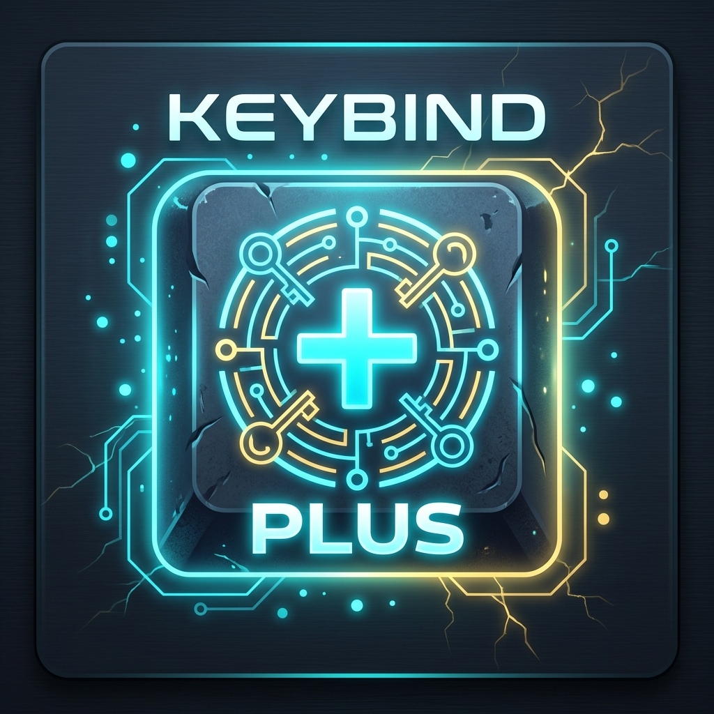

<div align="center">
  
  <h1>KeybindPlus (1.17.x)</h1>
  <p><strong>Client-side keybind profile manager, in-game editor, and conflict resolver for Minecraft.</strong></p>

  [](https://github.com/KVdz00/keybindplus/actions)
  [](LICENSE)
  [](VERSIONS.md)
</div>

---

> [!WARNING]
> **Branch Status: Experimental Backport (Beta)**
> - This branch (`1.17.x`) is an experimental port for **Minecraft 1.17.1** (Fabric & Forge).
> - It is in active development and subject to testing. For the stable release, visit the [`main`](https://github.com/KVdz00/keybindplus) branch (Minecraft 26.2+).
> - Compiled `.jar` files can be downloaded from the **Actions** tab build artifacts.

---

## Features

- **Named Profiles**: Save, rename, duplicate, and switch complete keybind configurations on the fly.
- **In-Game Editor**: Rebind or unbind keys (`NONE`) directly within profiles with real-time conflict highlights and hover tooltips.
- **Visual Compare & 1-Click Sync**: Compare two profiles side-by-side, filter differences, and copy keybindings across profiles with `<` and `>` sync buttons.
- **Sorting Modes**: Organize profiles by A-Z, Z-A, Newest, Oldest, Imported Only, or Local Only.
- **Clean Vanilla-Style UI**: Visual indicators with green active profiles, cyan imported profiles, and gold star (`★`) default indicators.
- **Quick Load Default**: Set or unset a default profile loaded on startup or via a single hotkey.
- **Undo & Rolling Backups**: Revert to previous keybindings with one click or restore from automatic rolling backups.
- **File Import & Export**: Import and export `.json` profiles directly via native file dialogs.
- **Silent Operation**: Zero chat message spam; status toasts appear only during file dialog actions.

---

## Controls & Keyboard Shortcuts

### Global Keybindings (In-Game)
| Action | Default Key | Description |
| :--- | :--- | :--- |
| **Open KeybindPlus** | `V` | Opens the main profile management and editor interface. |
| **Quick Load Default** | *Unbound* | Instantly applies your default profile during gameplay. |

*Rebindable in Minecraft Options -> Controls -> Key Binds -> KeybindPlus.*

### Menu Shortcuts (Inside KeybindPlus GUI)
| Shortcut | Action | Description |
| :--- | :--- | :--- |
| `Enter` | **Load** | Apply and activate selected profile. |
| `E` | **Edit** | Open in-game keybind editor for selected profile. |
| `C` | **Compare** | Choose a secondary profile to compare and sync keys. |
| `R` | **Rename** | Rename selected profile. |
| `D` | **Default / Unset** | Toggle setting or clearing default profile status. |
| `Delete` / `Backspace` | **Delete** | Delete selected profile with confirmation. |
| `Ctrl + S` | **Save** | Save current active keybinds to a new profile. |
| `Ctrl + D` | **Duplicate** | Clone selected profile. |
| `Ctrl + Z` | **Undo** | Revert keybinds prior to last loaded profile. |
| `V` / `Escape` | **Close** | Close KeybindPlus GUI and resume gameplay. |

---

## Installation & Requirements

- **Minecraft Version**: 1.17.1 (Experimental Beta)
- **Supported Loaders**: Fabric Loader (`>=0.14.0`) & Forge (`>=37.1.1`)
- **Required Dependencies**: Architectury API (`>=2.10.12`), Fabric API (Fabric only)
- **Java Runtime**: Java 16 or 17
- **Stable Branch**: [`main`](https://github.com/KVdz00/keybindplus) (Minecraft 26.2+)

Place the compiled `.jar` file into your `.minecraft/mods/` directory and launch the game.

---

## Storage Structure

Configuration files and profiles are stored in:
```text
.minecraft/config/keybindplus/
├── profiles/    # Saved keybind profiles (.json)
├── backups/     # Automatic rolling backups (up to 5)
├── exports/     # Exported profiles for sharing
└── imports/     # Default folder for imported profiles
```

---

## Building from Source

```bash
git clone https://github.com/KVdz00/keybindplus.git
cd keybindplus
./gradlew build
```

Compiled JARs will be generated in `fabric/build/libs/` and `neoforge/build/libs/`.

---

## License & Contributing

- Distributed under the [MIT License](LICENSE).
- Contribution guidelines and code standards are documented in [CONTRIBUTING.md](CONTRIBUTING.md).
